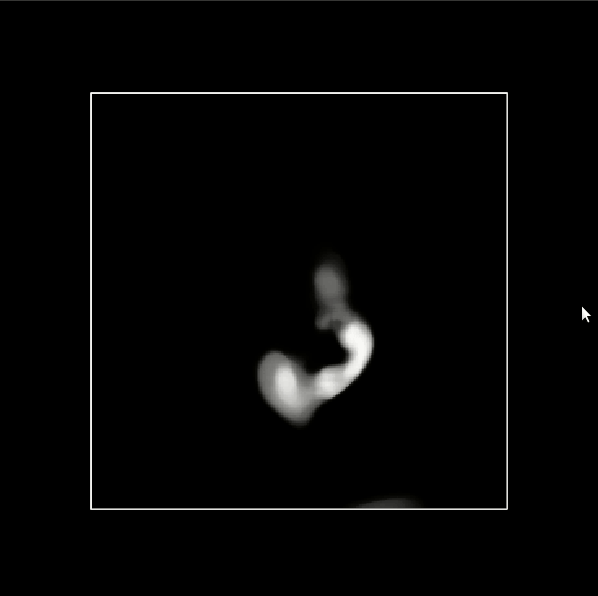

# Create an executable from a Python script: Pyinstaller, ITK, and VTK

## Project description

This example illustrates how, from a Python script, one can create a standalone
executable that performs some image processing using ITK, and shows the result
using VTK.

## Requirements

* python3

## How to build

Run the following commands:

    pip install -r requirements.txt
    pyinstaller my_vtk_viewer.py --additional-hooks-dir=. --onefile

## How to use

Run the following commands:

    cd dist && my_vtk_viewer my_input_image.nrrd my_output_image.nrrd 5

Visualization:

## Notes

In theory, this would work on any platform. In practice, the Python packages
have to be available for the platform on which you are trying to create
the executable. In case of a doubt, make sure that the necessary packages
are available on your platform.
